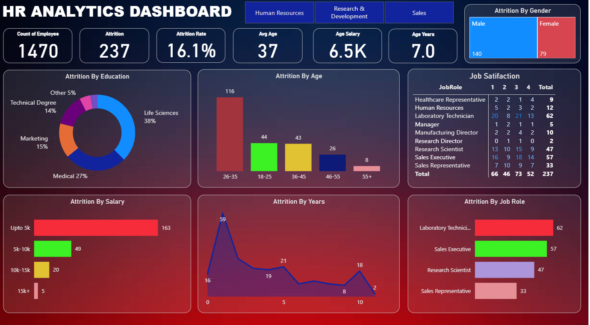

# 📊 HR Analytics Dashboard

An interactive **HR Analytics Dashboard** built using **Microsoft Power BI** to analyze employee attrition, workforce demographics, salary distribution, job satisfaction, and other key HR metrics.

---

## 📷 Dashboard Preview




## 📌 Project Overview

This dashboard helps HR teams gain valuable insights into employee data by analyzing:

- Employee Attrition
- Attrition Rate
- Employee Demographics
- Salary Distribution
- Job Satisfaction
- Department-wise Performance
- Education-wise Attrition
- Age-wise Attrition
- Gender Distribution

---

## 📈 Key Performance Indicators (KPIs)

| KPI | Value |
|------|-------|
| Total Employees | 1470 |
| Attrition Count | 237 |
| Attrition Rate | 16.1% |
| Average Age | 37 Years |
| Average Salary | 6.5K |
| Average Years at Company | 7.0 Years |

---

## 📊 Dashboard Features

- Employee Overview
- Attrition Analysis
- Education-wise Attrition
- Salary-wise Attrition
- Age Group Analysis
- Years at Company Analysis
- Job Satisfaction Analysis
- Gender-wise Attrition
- Department-wise Filtering

---

## 🛠 Tools & Technologies

- Microsoft Power BI
- Power Query
- DAX (Data Analysis Expressions)
- CSV Dataset

---

## 📂 Repository Structure

```text
HR-Analytics-Dashboard/
│── Dashboard/
│   └── HR_Analytics_Dashboard.pbix
│
├── Data/
│   └── HR_Analytics.csv
│
├── Images/
│   └── dashboard.png
│
└── README.md
```

---

## 🚀 How to Use

1. Clone this repository.
2. Open the `.pbix` file using **Microsoft Power BI Desktop**.
3. If prompted, update the data source path to the dataset in the `Data` folder.
4. Refresh the data.

---

## 💡 Business Insights

- The dashboard identifies departments with the highest attrition.
- Employee attrition is analyzed across salary ranges and age groups.
- Job satisfaction trends help understand workforce engagement.
- Interactive filters allow users to explore the data dynamically.

---

## 👨‍💻 Author

**Rushay Gopani**

- GitHub: https://github.com/RushayGopani
